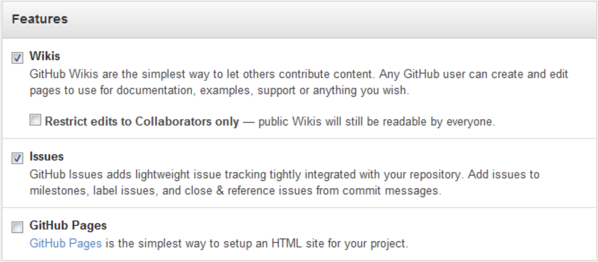

=======================
GitHub Pages 入门
=======================

为使项目更方便的被人理解，介绍页面少不了，甚至会需要完整的文档站。
Github替你想到了这一点，提供了Github Pages的服务，不仅可以方便的为项目建立介绍站点，也可以用来建立个人博客。

Github Pages 优缺点
===================

**Github Pages有以下几个优点：**

* 轻量级的博客系统，没有麻烦的配置

* 使用标记语言，比如Markdown

* 无需自己搭建服务器

* 根据Github的限制，对应的每个站有300MB空间

* 可以绑定自己的域名

**当然 Github Pages 也有缺点：**

* 使用Jekyll模板系统，相当于静态页发布，适合博客，文档介绍等。

* 动态程序的部分相当局限，比如没有评论，不过还好我们有解决方案。

* 基于Git，很多东西需要动手，不像Wordpress有强大的后台。

* 与GitHub建立好链接之后，就可以方便的使用它提供的Pages服务。

---------------------------

GitHub Pages 两种类型
======================

1. User or organization site: 
>>>>>>>>>>>>>>>>>>>>>>>>>>>>>>

GitHub用户名建立的username.github.io这样的用户&组织页(站)

2. Project site: 
>>>>>>>>>>>>>>>>>

依附项目的pages

**开始你的个人博客之旅吧！**
快速进入：
`构建个人或企业网站`_
`构建项目网站`_

如何区别 user 和 project 网站?
>>>>>>>>>>>>>>>>>>>>>>>>>>>>>>>>>>>>

*注意：每个用户名下面只能建立一个隶属于个人的 page。但是在其他的 GitHub 项目中，你也可以通过 GitHub Pages 生成你的项目网站，使用名称为 othername.github.io*

进入你的 GitHub 仓库，点击 Admin 进入项目管理，可以看到如下设置：

|githubpages_admin|

而普通的项目是这样的:

|githubpages_project_admin|

这些你都不需要完全理解，先来看看 **个人页面** 怎么创建吧！

Reference
===========

.. [#] http://beiyuu.com/github-pages

.. |githubpages_admin| image:: image/githubpages_admin.png

:作者: 蒲蕾颖

:时间: 2018年04月24日
