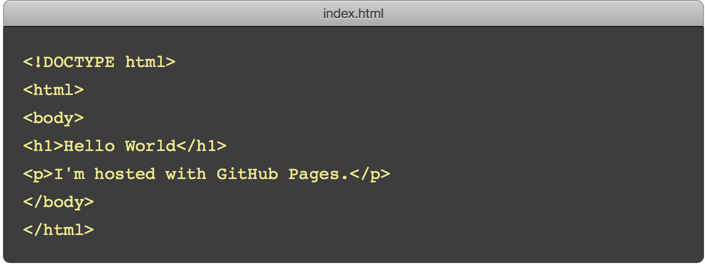
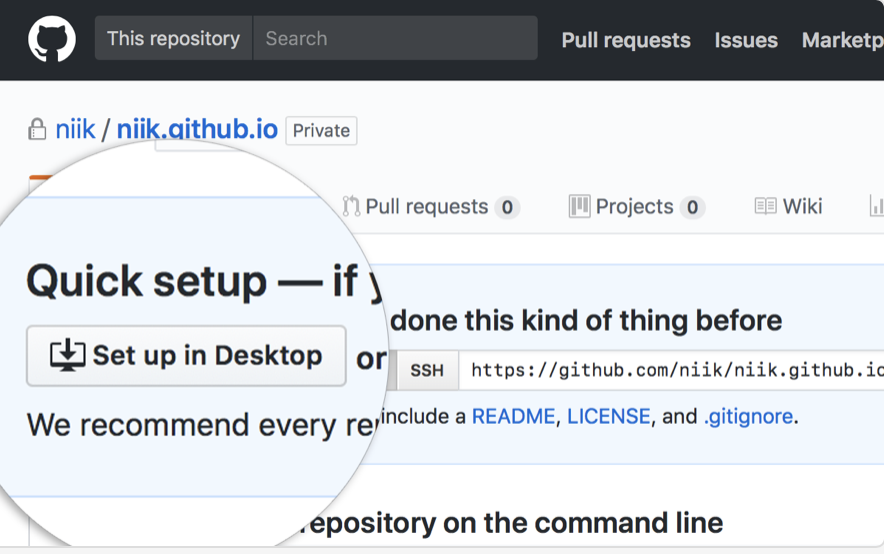

=========================================
构建个人或企业网站
=========================================

这是 GitHub Pages 可以构建的第一种页面类型：User or organization site。

我们通过这种方法来构建个人博客，成品形如 `beiyuu <beiyuu.github.io>`_ 这样的可访问的站。
在开始简历个人博客前，你需要掌握以下概念并下载相关工具：

* GitHub

* repository

* clone

* master

* branch

* 下载 GitHub Desktop

你可以参考 `GitHub Pages官方文档 <https://pages.github.com/>`_，或参照以下步骤快速构建个人博客：

1. 在 GitHub 上创建仓库
>>>>>>>>>>>>>>>>>>>>>>>

进入你的 `GitHub <https://github.com/>`_, 创建新的仓库 (repo)，仓库名称为`username.github.io`。

2. 将线上仓库转移到本地
>>>>>>>>>>>>>>>>>>>>>

这里推荐使用 GitHub Desktop。如果你已经提前下载，那么请继续阅读。如果你还没有 GitHub Desktop，可前往官网下载。！

在你的 repo 中点击 “Set up in Desktop” 按钮，GitHub 将自动在弹出的 GitHub Desktop 中 clone 这个仓库，请给这个仓库选择一个本地地址保存。
    
|2_cloneRepo|

此时，你的 username.github.io 项目就创建好了！

*Tips: 如果 GitHub Desktop 没有自动弹出，你可以在应用中手动 clone 这个仓库。*

3. 添加 index 文件
>>>>>>>>>>>>>>>>>>>>>>>>

你只需要在本地仓库文件夹中添加一个简单的 index.html 文件：

|index|

将这个 index.html 文件保存到本地的仓库文件中，GitHub Desktop 会自动识别出本地仓库的改变。

4. 从本地推到线上
>>>>>>>>>>>>>>>>>>

这一步又叫做 **Commit & push**，将会把你在本地保存的文件，通过 GitHub Desktop 推送到网络上。具体步骤如下：

* 进入 GitHub Desktop，在左侧输入这次改变的 summary 和 discription, 点击 Commit to master 按钮。这是在将你所做的本地文件合并到项目主干 (master branch) 上。

* 在菜单栏点击 publish branch 按钮，将本地内容 push 到线上 (pushing to origin)。

|desktop-demo|

5. 成功生成你的个人博客！
>>>>>>>>>>>>>>>>>>>>>>

恭喜你！拥有了第一个属于自己的博客页面，世界的 netizen 都能看的到哦！

第一次页面生效需要一些时间，大概10分钟左右。
生效之后，访问 username.github.io 就可以看到你上传的页面了，beiyuu.github.io 就是一个例子。

Reference
===========

.. [#] http://beiyuu.com/github-pages
.. [#] https://pages.github.com
.. [#] https://github.com

.. |desktop-demo| image:: image/desktop-demo.gif

:作者: 蒲蕾颖

:时间: 2018年04月23日