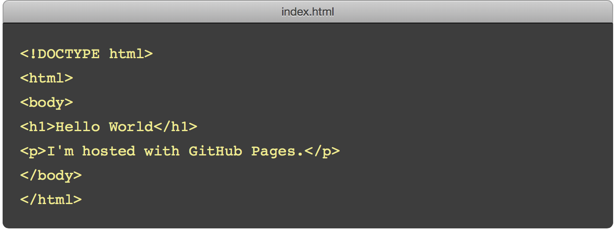
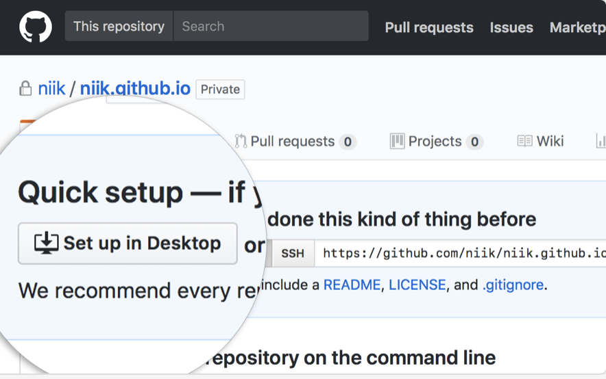

=======================
使用GitHub Pages建立博客
=======================

与GitHub建立好链接之后，就可以方便的使用它提供的Pages服务。

GitHub Pages分两种：

1. **User or organization site**: GitHub用户名建立的username.github.io这样的用户&组织页(站)
2. **Project site**: 依附项目的pages

个人或企业网站
==========================

个人或企业网站 User or Organization Site

建立个人博客是用的是第一种，成品形如 beiyuu.github.io 这样的可访问的站。
在开始以下的步骤前，你需要掌握以下概念并下载相关工具：

* GitHub

* Repository

* Clone

* GitHub Desktop

你可以参考 `GitHub Pages官方文档<https://pages.github.com/>`_，或参照以下步骤：

#. 在 GitHub 上建立仓库

进入你的 `GitHub<https://github.com/>`_, 创建新的仓库 (repo)，仓库名称为`username.github.io`。

*每个用户名下面只能建立一个隶属于个人的page*

#. 将线上仓库转移到本地

这里推荐使用 GitHub Desktop。如果你已经提前下载，那么请继续阅读。如果你还没有 GitHub Desktop，可前往官网下载。！

在你的 repo 中点击 “Set up in Desktop” 按钮，GitHub 将自动在弹出的 GitHub Desktop 中 clone 这个仓库，请给这个仓库选择一个本地地址保存。
    
|2_cloneRepo|

此时，你的 username.github.io 项目就创建好了！

*如果 GitHub Desktop 没有自动弹出，你可以在应用中手动 clone 这个仓库。*

#. 添加index文件并提交

你只需要在本地仓库文件夹中添加一个简单的 index.html 文件：

|index|

将这个 index.html 文件保存到本地的仓库文件中，GitHub Desktop 会自动识别出本地仓库发生的改变。

#. Commit & push 

进入 GitHub Desktop，在左侧输入这次改变的 summary 和 discription, 点击 Commit to master 按钮。
在菜单栏点击 publish branch 按钮，将本地内容 push 到线上 (pushing to origin)。

|desktop-demo|

第一次页面生效需要一些时间，大概10分钟左右。
生效之后，访问 username.github.io 就可以看到你上传的页面了，beiyuu.github.io就是一个例子。

#. 如何区别 user 和 project 网站 ！
点击Admin进入项目管理
可以看到是这样的： user pages 而普通的项目是这样的，

即使你也是用的othername.github.io： other pages

Project Site
==============

第二种项目pages和用户pages使用的后台程序是同一套，只不过它的目的是项目的帮助文档等跟项目绑定的内容，所以需要在项目的gh-pages分支上去提交相应的文件，GitHub会自动帮你生成项目pages。
具体的使用帮助可以参考 `GitHub Pages官方文档<https://pages.github.com/>`_

_reference

.. [#] http://beiyuu.com/github-pages

.. |desktop-demo| image:: image/desktop-demo.gif

:作者: 蒲蕾颖

:时间: 2018年04月23日
